> Note: The SharePoint Framework is currently in preview and is subject to change. SharePoint Framework client-side web parts are not currently supported for use in production enviornments.

# SPFx Custom Fields Library

This library is a kit of **23+ components** to customize SPFx web parts custom fields, to make the **optimal experience to edit your Web Parts**.

This kit includes Web Part property fields as **PropertyFieldDatePicker**, **PropertyFieldDateTimePicker**, **PropertyFieldPicturePicker**,
**PropertyFieldDocumentPicker**,**PropertyFieldPeoplePicker**, **PropertyFieldColorPicker**, **PropertyFieldFontPicker**,
**PropertyFieldFontSizePicker**, **PropertyFieldIconPicker**, **PropertyFieldSliderRange**,
**PropertyFieldRichTextBox**, **PropertyFieldDisplayMode**, **PropertyFieldAlignPicker**,
**PropertyFieldCustomList**, **PropertyFieldSPListPicker**, **PropertyFieldSPListMultiplePicker**, **PropertyFieldSPListQuery**,
**PropertyFieldSPFolderPicker**, **PropertyFieldPhoneNumber**, **PropertyFieldMaskedInput**, **PropertyFieldDropDownSelect**,
**PropertyFieldMapPicker**. These controls are based on the Office UI Fabric framework and React. You can use these custom
fields to your own client side Web Parts.

Now available in more than 16 languages as: English, French, Arabic, German, Chinese, Danish, Spanish, Finnish, Hindi, Italian,
Japanese, Norwegian, Dutch, Portuguese, Russian, Swedish.

**Current stable version: 1.0.3** - [Release note](https://github.com/OlivierCC/sp-client-custom-fields/wiki/Logs-&-Updates)

# How to install & use

To install this library is your project, open a command line and execute this command in your WebPart's folder:
```bash
npm i --save sp-client-custom-fields
```
Open your file `'config/config.json'`, and add the following lines in the **externals** and in the **localizedResources** sections:
```
"externals": {
   "sp-client-custom-fields": "node_modules/sp-client-custom-fields/dist/sp-client-custom-fields.bundle.js"
}
"localizedResources": {
    "sp-client-custom-fields/strings": "../node_modules/sp-client-custom-fields/lib/loc/{locale}.js"
}
```
Execute gulp in the command line
```bash
gulp
```

**You are now ready to use a custom property field in your web part!** It's really easy to add a custom property field in your project, you can read any property documentation bellow to view how to do that.   [More information](https://github.com/OlivierCC/sp-client-custom-fields/wiki/How-to-install-%3F). You can also consult our [list of samples](https://github.com/OlivierCC/sp-client-custom-fields/wiki/How-to-try-a-sample-%3F) to have more information or sample usages.

# Overview

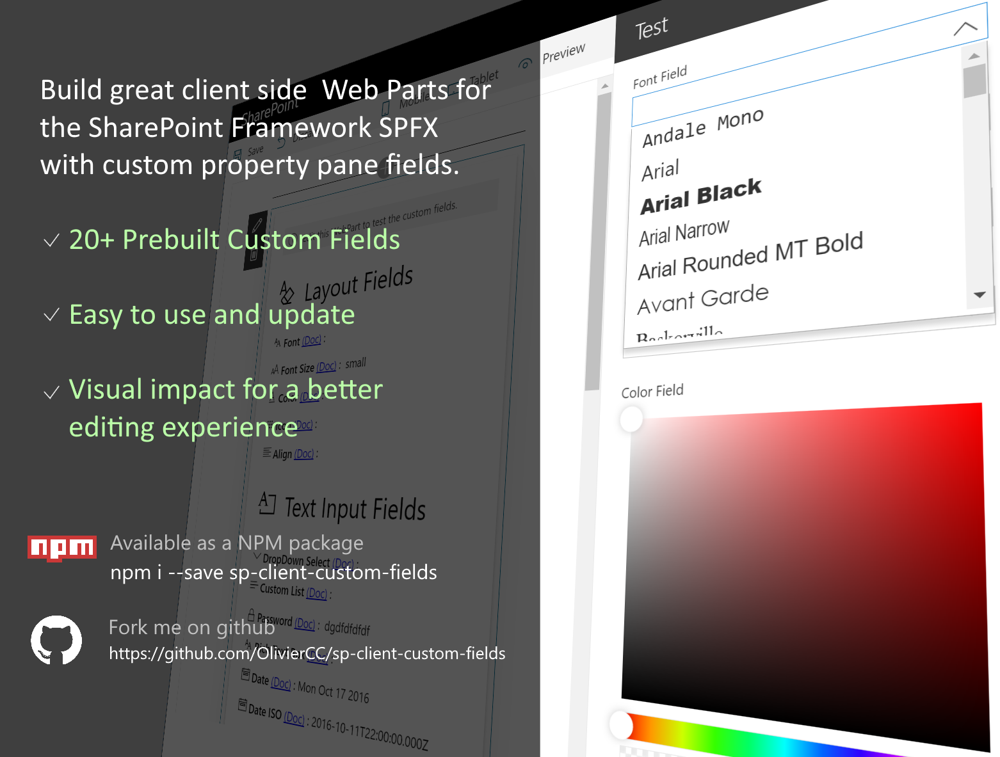

# Custom Fields documentation

You can use these custom fields to your own client side web parts. You can find bellow the list of
all these custom fields and you can click on the custom field name to consult the documentation.

## Layout Management

Custom Field | Description |  Overview
------------ | ----------- | -----------
[PropertyFieldColorPicker](https://github.com/OlivierCC/sp-client-custom-fields/wiki/PropertyFieldColorPicker) | Custom field to select a Color with a visual RGB editor based on the Office UI Fabric ColorPicker control | 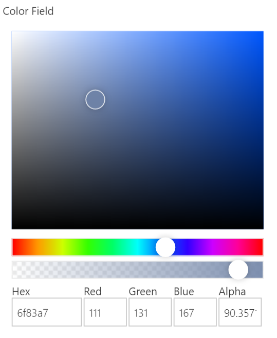
[PropertyFieldFontPicker](https://github.com/OlivierCC/sp-client-custom-fields/wiki/PropertyFieldFontPicker) | Custom field to select a Font with a visual dropdown box and fonts preview | 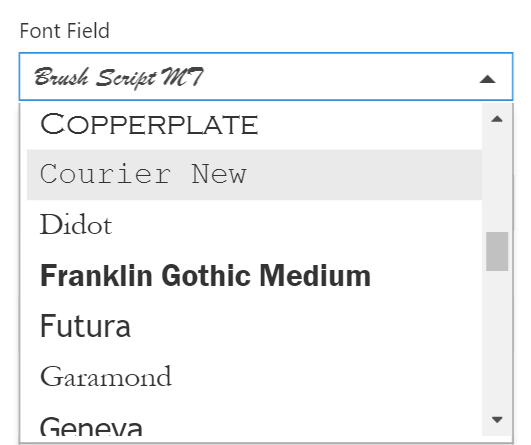
[PropertyFieldFontSizePicker](https://github.com/OlivierCC/sp-client-custom-fields/wiki/PropertyFieldFontSizePicker) | Custom field to select a Font size with size preview as drop down | 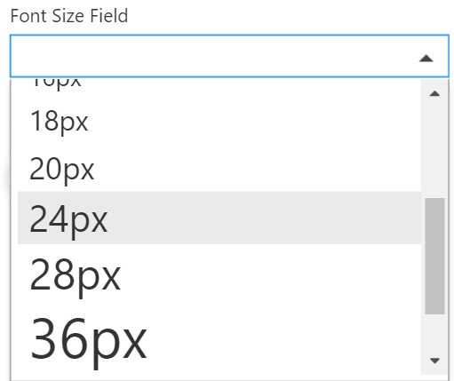
[PropertyFieldIconPicker](https://github.com/OlivierCC/sp-client-custom-fields/wiki/PropertyFieldIconPicker) | Custom field to select an Icon style in the Office UI Fabric icons list | 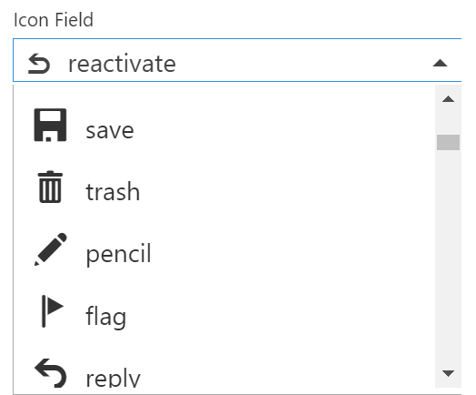
[PropertyFieldAlignPicker](https://github.com/OlivierCC/sp-client-custom-fields/wiki/PropertyFieldAlignPicker) | Custom field to select an alignement (left, center or right) | 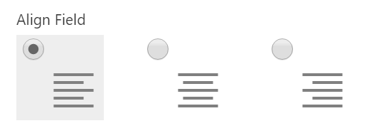
[PropertyFieldDisplayMode](https://github.com/OlivierCC/sp-client-custom-fields/wiki/PropertyFieldDisplayMode) | Custom field to select a list display mode (list or tiles) | 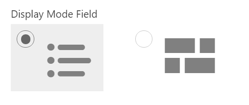

## Text & Form Inputs

Custom Field | Description |  Overview
------------ | ----------- | -----------
[PropertyFieldDatePicker](/OlivierCC/sp-client-custom-fields/wiki/PropertyFieldDatePicker) | Custom field to select a Date with a mini-calendar based on the Office UI Fabric DatePicker control | 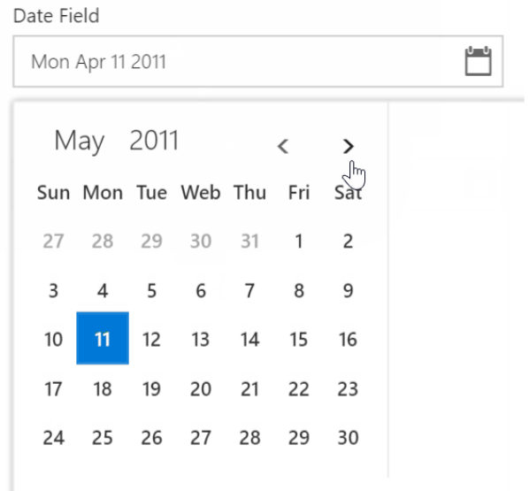
[PropertyFieldDateTimePicker](/OlivierCC/sp-client-custom-fields/wiki/PropertyFieldDateTimePicker) | Custom field to select a Date Time with a mini-calendar based on the Office UI Fabric DatePicker control | 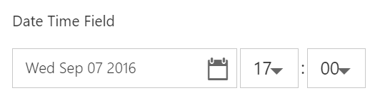
[PropertyFieldDropDownSelect](https://github.com/OlivierCC/sp-client-custom-fields/wiki/PropertyFieldDropDownSelect) | Custom field to select multiple values in a dropdown with checkbox | 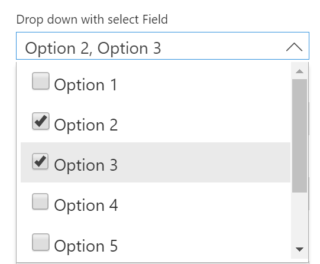
[PropertyFieldSliderRange](https://github.com/OlivierCC/sp-client-custom-fields/wiki/PropertyFieldSliderRange) | Custom field to select a range of numbers with a 2 levels slider | 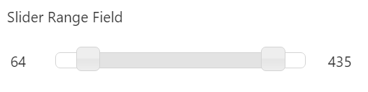
[PropertyFieldRichTextBox](https://github.com/OlivierCC/sp-client-custom-fields/wiki/PropertyFieldRichTextBox) | Custom field to insert a rich text area to generate html with WYSIWYG | 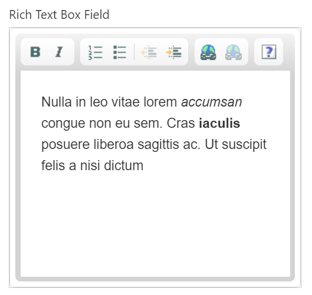
[PropertyFieldPassword](https://github.com/OlivierCC/sp-client-custom-fields/wiki/PropertyFieldPassword) | Custom field to select a password | 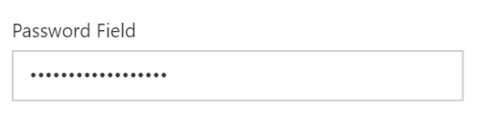
[PropertyFieldPhoneNumber](https://github.com/OlivierCC/sp-client-custom-fields/wiki/PropertyFieldPhoneNumber) | Custom field to select a phone number with a masked control based on phone numbers international formats. | 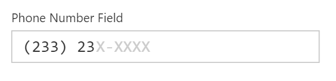
[PropertyFieldMaskedInput](https://github.com/OlivierCC/sp-client-custom-fields/wiki/PropertyFieldMaskedInput) | Custom field to add a text input with a specified masked based on regexp. | 
[PropertyFieldMapPicker](https://github.com/OlivierCC/sp-client-custom-fields/wiki/PropertyFieldMapPicker) | Custom field to add a gps localisation with map preview. | 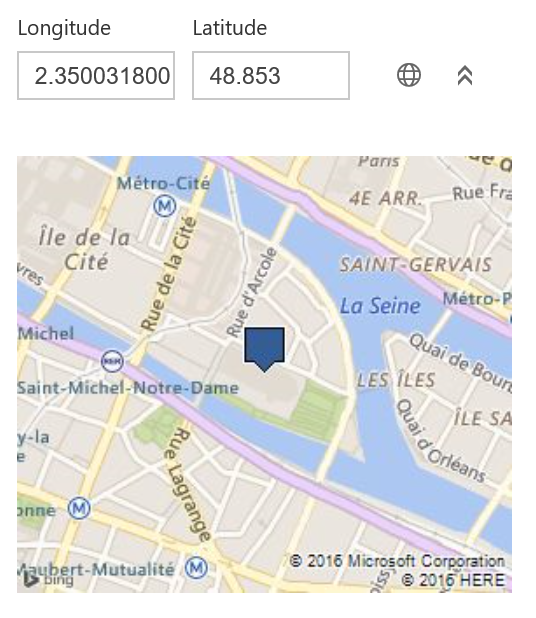

## SharePoint

Custom Field | Description |  Overview
------------ | ----------- | -----------
[PropertyFieldPeoplePicker](https://github.com/OlivierCC/sp-client-custom-fields/wiki/PropertyFieldPeoplePicker) | Custom field to select users from the SharePoint users database with a search field. Start to enter a lastname or a firstname, and pick a user  | 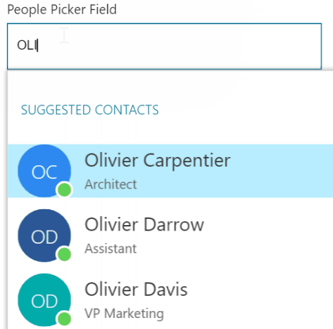
[PropertyFieldPicturePicker](https://github.com/OlivierCC/sp-client-custom-fields/wiki/PropertyFieldPicturePicker)| Custom field to select a picture thanks to a SharePoint visual browser.  | 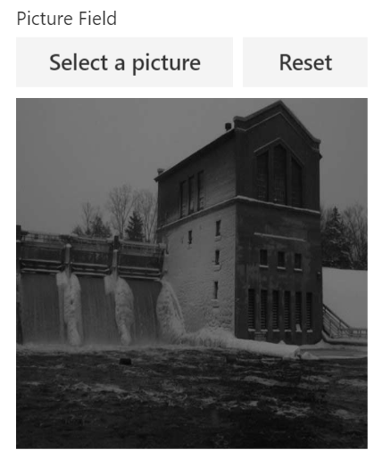
[PropertyFieldDocumentPicker](https://github.com/OlivierCC/sp-client-custom-fields/wiki/PropertyFieldDocumentPicker)| Custom field to select a document (docx, pptx, pdf, etc.) thanks to a SharePoint visual browser.  | 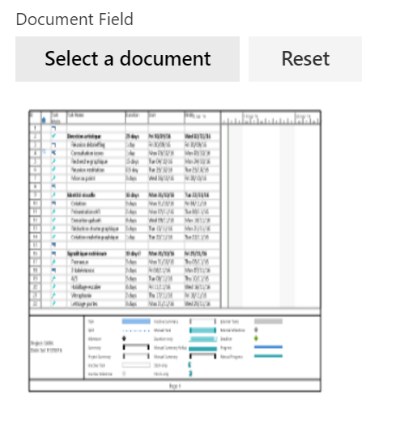
[PropertyFieldCustomList](https://github.com/OlivierCC/sp-client-custom-fields/wiki/PropertyFieldCustomList)| Custom field to select a collection of data with forms as an object property of your web part  | 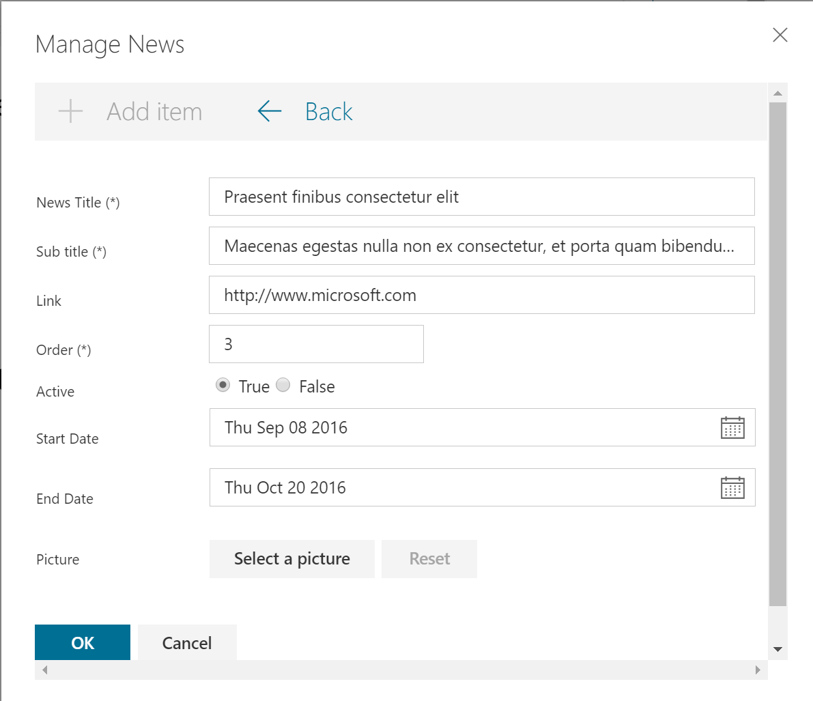
[PropertyFieldSPListPicker](https://github.com/OlivierCC/sp-client-custom-fields/wiki/PropertyFieldSPListPicker)| Custom field to select a list from the current SharePoint web site.   | 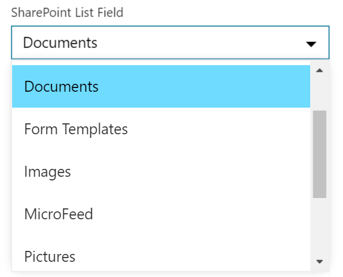
[PropertyFieldSPListMultiplePicker](https://github.com/OlivierCC/sp-client-custom-fields/wiki/PropertyFieldSPListMultiplePicker)| Custom field to select multiple lists from the current SharePoint web site.   | 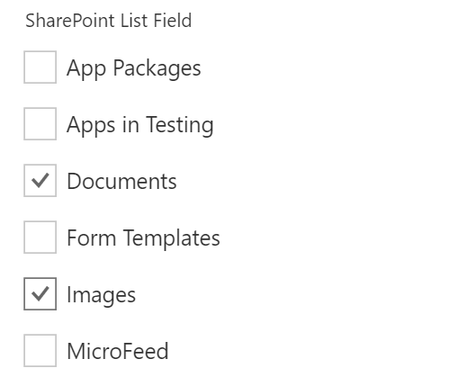
[PropertyFieldSPListQuery](https://github.com/OlivierCC/sp-client-custom-fields/wiki/PropertyFieldSPListQuery)| Custom field to query parameters and to get a REST web url to get items.   | 
[PropertyFieldSPFolderPicker](https://github.com/OlivierCC/sp-client-custom-fields/wiki/PropertyFieldSPFolderPicker)| Custom field to select a folder from the current SharePoint web site.   | 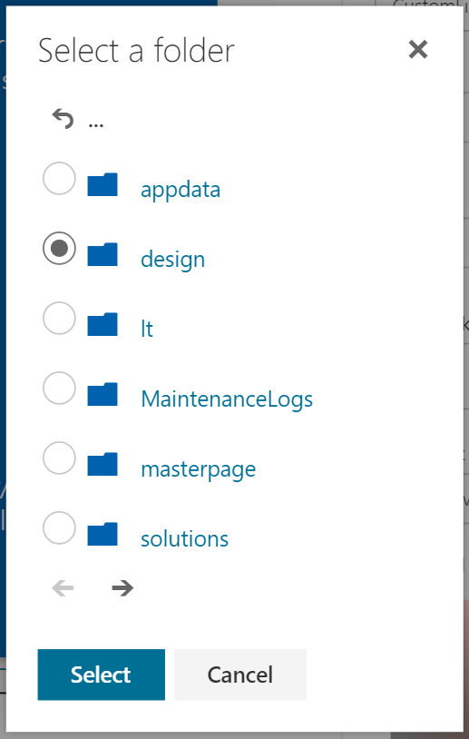


# The MIT License (MIT)

Copyright (c) 2016 Olivier Carpentier

Permission is hereby granted, free of charge, to any person obtaining a copy of this software and associated documentation files (the "Software"), to deal in the Software without restriction, including without limitation the rights to use, copy, modify, merge, publish, distribute, sublicense, and/or sell copies of the Software, and to permit persons to whom the Software is furnished to do so, subject to the following conditions:

The above copyright notice and this permission notice shall be included in all copies or substantial portions of the Software.

THE SOFTWARE IS PROVIDED "AS IS", WITHOUT WARRANTY OF ANY KIND, EXPRESS OR IMPLIED, INCLUDING BUT NOT LIMITED TO THE WARRANTIES OF MERCHANTABILITY, FITNESS FOR A PARTICULAR PURPOSE AND NONINFRINGEMENT. IN NO EVENT SHALL THE AUTHORS OR COPYRIGHT HOLDERS BE LIABLE FOR ANY CLAIM, DAMAGES OR OTHER LIABILITY, WHETHER IN AN ACTION OF CONTRACT, TORT OR OTHERWISE, ARISING FROM, OUT OF OR IN CONNECTION WITH THE SOFTWARE OR THE USE OR OTHER DEALINGS IN THE SOFTWARE.
